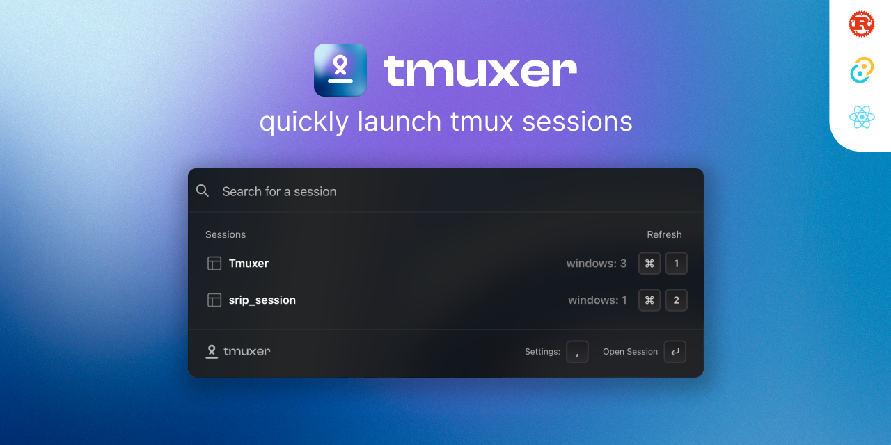

# Tmuxer



Tmuxer helps you to quickly search and open your Tmux sessions in your desired terminal.

<b>Default shortcut: `CMD + SHIFT + G`</b>

### [❇️ Download now](https://parthj.gumroad.com/l/tmuxer)
### [🛠️ Build from source](#🛠️-building-for-production)

### [Feature request / Bug reports](https://aypm88dy390.typeform.com/to/xuHkrO4m)

## ⛰️ Preview

<small>If preview is not loaded, please visit here [preview gif](./docs/TmuxerDemo.gif).</small>


## 🤝 Contributing

To get Tmuxer set up on your machine, you'll need to have Rust and NPM installed. Then, follow these steps:

1. Clone the project using `git clone https://github.com/ParthJadhav/Tmuxer.git`
2. Change into the project directory: `cd Tmuxer`
3. Install dependencies: `npm install`
4. Run the development server: `npm run tauri dev`

If you encounter any issues, try running `yarn tauri build` after installing dependencies.

## 🛠️ Building for Production

### Adding Targets

```bash
rustup target add aarch64-apple-darwin
rustup target add x86_64-apple-darwin
```

### Building

```bash
yarn package-and-build
```

This will create a production build of the app both `aarch64` & `x86_64` systems in the `src-tauri/target` directory.

All contributions from the open-source community, individuals, and partners are welcomed. Our achievement is a result of your active participation.

Checkout [Issues section](https://github.com/ParthJadhav/Tmuxer/issues) to find out what needs to be done.

[Contributing guidelines](docs/CONTRIBUTING.md)

[Code of conduct](CODE_OF_CONDUCT.md)

## 📝 License

Tmuxer is licensed under the GNU AFFERO GENERAL PUBLIC LICENSE. See the [LICENSE file](./LICENCE) for more information.
